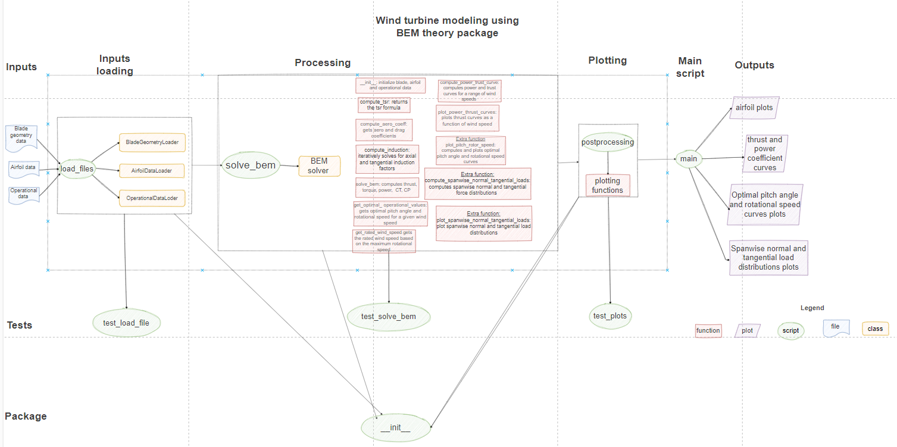

[](https://classroom.github.com/a/zjSXGKeR)
# Our Great Package

Team: NoOneKnows

## Overview

This project uses the BEM theory to model the wind turbine. It takes as inputs:
 - blade geometry data - ./inputs/IEA-15-240-RWT/IEA-15-240-RWT_AeroDyn15_blade.dat
 - airfoil data - ./inputs/IEA-15-240-RWT/Airfoils
 - operational data - IEA-15-240-RWT_AeroDyn15_Polar_{af_key}.dat

The purpose of the code is to forecast the aerodynamic behaviour of a wind turbine blade, and the final output is to plot the power curve and thrust curve.


The code performs the following key tasks:
- Loads wind turbine data.
- Computes lift coefficients and drag coefficients.
- Computes the axial and tangential induction factors.
- Computes the thrust torque and power.
- Computes optimal operational strategy.
- Computes power and thrust.
- Compute spanwise loads (tangential and normal)
- Generates plots.

## Quick-start guide

### 1. Clone the repository
```sh
git clone <repository_url>
cd <repository_directory>
```

### 2. Install the package
Create a new environment through the file environment.yml
```sh
conda env create -f environment.yml
```
Activate it
```sh
conda activate wt
```

Open the terminal and install the package:
```sh
pip install .
```

### 3. Install packages
Ensure you have Python installed. Then, install the required packages (numpy, scipy, matplotlib ecc..):

```sh
pip install numpy pandas mathplotlib
```

### 4. Run the main script
Execute the script to analyze the wind data:
```sh
python examples/main.py
```

### **Project Directories & files**
- **`./examples/`**: 
    - **`./main/`** 
- **`./inputs/`**:
  - **`./IEA-15-240-RWT/`** 
  - **`project_structure.drawio/`**: diagram of the code structure.
- **`./outputs/`** 
- **`./src`**:
    - **`./__init__/`**
    - **`./load_files/`**
    - **`./postprocessing/`**
    - **`./solve_bem/`**
- **`./tests`**:
    - **`./test_load_file/`**
    - **`./test_plot/`**
    - **`./test_solve_bem/`** 
- **`./pyproject.toml/`**
- **`./environment.yml`**
- **`./README.md`**:
- **`./.gitignore`**

## 5. How the code works

The project consists of the following core components:

### **Main Script**
- **`main.py`**: The primary script that manages the entire process using the helper functions contained in **`__init__.py`** with the following steps:
  - Loads wind data from the `./inputs/IEA-15-240-RWT/` directory.
  - Computes the power and thrust values.
  - Generates plots to visualize results.

### **Helper Functions**
- **`__init__.py`**: Recalls the following files:
    - **`load_file.py`**:
      ### classes for Data Loading:
      - BladeGeometryLoader: loads the blade geometry data.
      - AirfoilDataLoader: loads the airfoil data. 
      - OperationalDataLoader: loads the operational data. 
    -**`solve_bem.py`**:
      ### class for Simulation:
      - BEMSolver: this class computes the rotational speed as well as the thrust, torque, power, lift and drag coefficients.
    -**`postprocessing.py`**:
      -Results Processing & Visualization through plots

## Architecture

The package takes the blade geometry data, the airfoil data and the operational data through three different classes and uses them in the BEMsolver class contained in the solve_bem script. In the postprocessing folder the plotting function are defined and all the scripts can be run through main.py by recalling the package wt.



The diagram source file can be found [here](inputs/project_structure.drawio).

## Peer review

For this project, everybody tried to understand and begin to approach the code alone. This to have a deep understanding of the problem and a structured idea on how to solve it. 
Every Tuesday morning and Thursday after class we have implemented the code for the files contained in our package wt, by following the project structure and guidelines.After ensuring that the package was working correctly, we have created main.py to be able to see the results and plots.
Then, three tests for each file contained in the wt package have been created and tested, to be sure they were correct.
Lastly, Pylint guidelines have been applied to the codes and this README file has been created.
This group workflow can be clearly seen in the pull request history, which has been frequently updated by different team member in agreement with the others. 